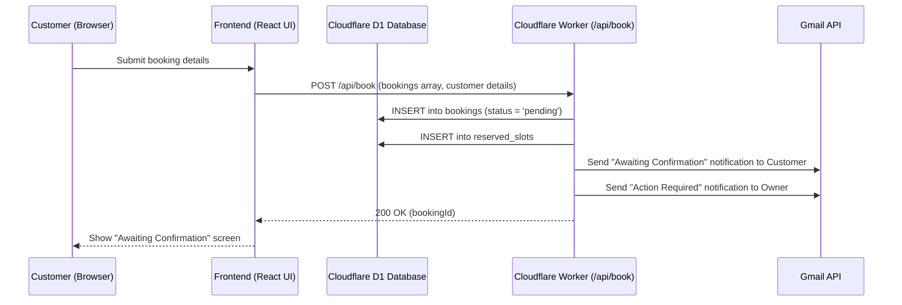
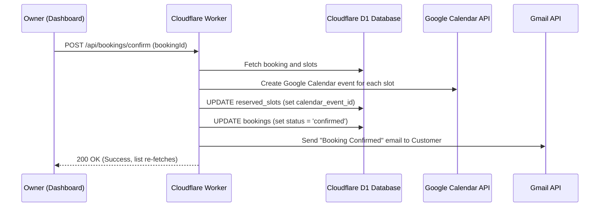

# Athletics Court Booking System Architecture

## Overview
The Athletics Court Booking System is a web-based application designed to facilitate court reservations for "The Paddle Club". It features an interactive layout map where users can select courts, choose dates and times, and submit reservation requests. 

Rather than booking directly into Google Calendar, reservations are first persisted in a Cloudflare D1 SQL database in a `pending` state. An owner dashboard (accessible at `/dashboard` with passcode protection) allows the business owner to confirm or reject reservations. Once confirmed, the system automatically schedules the sessions on Google Calendar, updates the database, and sends confirmation emails to the client via the Gmail API.

## Technology Stack

### Frontend
- **Framework**: React 18 with Vite
- **Language**: TypeScript
- **Styling**: Tailwind CSS, Lucide React (icons)
- **Deployment**: Built into static assets served via Cloudflare

### Backend
- **Framework**: Cloudflare Workers
- **Database**: Cloudflare D1 (SQL Database) for persisting bookings and reserved slots
- **Integrations**: 
  - **Google Calendar API**: To schedule and manage confirmed court booking events.
  - **Gmail API**: To dispatch confirmation/rejection emails to clients and booking notifications to the owner.
  - **Google OAuth2**: Using Refresh Tokens to authorize server-to-server Google API requests.

---

## Database Schema (D1 SQL)

### `bookings` Table
Stores main reservation headers and customer details.
* `id` (TEXT, PK): Unique booking UUID
* `name` (TEXT): Customer's name
* `email` (TEXT): Customer's email
* `phone` (TEXT): Customer's contact number
* `message` (TEXT): Optional customer message/notes
* `status` (TEXT): `'pending'` | `'confirmed'` | `'rejected'`
* `created_at` (TEXT): ISO timestamp of submission

### `reserved_slots` Table
Stores individual timeslots associated with a booking.
* `id` (INTEGER, PK AUTOINCREMENT)
* `booking_id` (TEXT, FK references `bookings.id` ON DELETE CASCADE)
* `court` (INTEGER): Court number (1-6)
* `date` (TEXT): Booking date (`YYYY-MM-DD`)
* `time_slot` (TEXT): Selected timeslot string (e.g. `'09:00 AM'`)
* `calendar_event_id` (TEXT): Google Calendar event ID (populated after owner confirmation)

---

## User Interaction Workflows

### 1. Customer Booking Workflow
1. **Court Selection**: The user interacts with the top-down graphical layout of the courts. Clicking courts toggles selection.
2. **Scheduling Mode**: The user chooses between **Batch** (apply same date & time to all courts) or **Individual** scheduling.
3. **Detail Submission**: The customer enters Name, Email, Phone, and optional Message, then submits.
4. **Pending Confirmation Screen**: The frontend displays a success alert stating the booking is "Awaiting Confirmation" with slot summaries.

### 2. Owner Confirmation & Management Workflow
1. **Dashboard Access**: The owner navigates to `/dashboard` and enters the security passcode (`admin123`).
2. **Review Requests**: The owner views pending requests. Availability fetches block only `confirmed` bookings, ensuring slots remain open to other clients until approved.
3. **Action (Confirm)**: Owner clicks "Confirm". The worker marks the booking status as `confirmed`, creates Google Calendar events, and emails the customer.
4. **Action (Reject)**: Owner clicks "Reject". The worker marks the status as `rejected` and emails a decline notification to the customer.

---

## Customization and Branding Guide (White-Label Setup)

### 1. Frontend Logo & Branding
* **Banner Text**: Edit the absolute header banner container inside **[App.tsx](file:///c:/Website/service-provider/booking/athletics-court/src/app/App.tsx)**. Locate `THE PADDLE CLUB` and change the text values or swap them with an image tag.
* **Colors & Theme**: Swap Tailwind color accents (e.g., `bg-slate-800`, `text-amber-400`) to match your customer's branding.

### 2. Email Notifications & Owner Address
* **Branding Logo**: The styled header HTML badge (`emailHeaderHtml`) is defined inside **[worker.ts](file:///c:/Website/service-provider/booking/athletics-court/src/worker.ts)**. Adjust styling and text here.
* **Owner Destination Email**: The worker dynamically routes owner notifications to the email address set in the **`GOOGLE_CALENDAR_ID`** environment variable. When onboarding new clients, update this value in **[wrangler.toml](file:///c:/Website/service-provider/booking/athletics-court/wrangler.toml)**.
